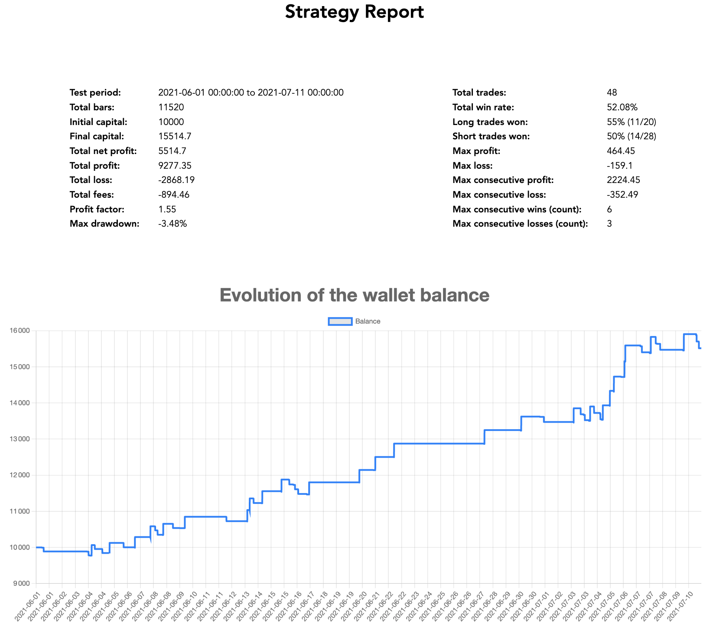

# Binance trading bot

## Setup Environment

### Development

Set your api keys to the environment variables for testnet in `.env`. Check https://testnet.binancefuture.com/en/futures/BTCUSDT and https://testnet.binance.vision/ to get your keys. Then run the commands:

```
npm run build:dev
npm run dev
```

### Production

Get your api keys from your Binance account and set them to the environment variables `BINANCE_PUBLIC_KEY` and `BINANCE_PRIVATE_KEY` in the file `.env`. Then, run the commands:

```
npm run build:prod
npm run prod
```

## Create your strategy

You can create your own strategy for your bot. The file must be placed in `src/configs`. There are some examples to help you to create the best strategy. Check the declaration file `global.d.ts` to have an overview of the possibilities you can add to your strategy. And don't forget to backtest your strategy before running it in production !

## Backtesting

You can backtest your own strategy by running the backtest mode. To do that, you need to:

1. Download the data for your currencies at https://www.cryptodatadownload.com/data/binance/ and move the files to the folder `data`. Run the command `npm run data` to generate your historical data on multiple time frames (1m, 5m, 15m, 30m, 1h, 2h, 4h, 6h, 12h, 1d) that you want.
2. When the data are ready, update the json file `config.json` as you want to prepare the backtest.
3. Tap the commands `npm build:test` and `npm run test` to run the backtest.
4. When the backtest ends, it generates a log file in the folder `logs` and an html report in `reports`. You can consulting these to evaluate the performance and profitability of your strategy.



## Documentation

- https://github.com/binance/binance-spot-api-docs/blob/master/rest-api.md
- https://github.com/Ashlar/binance-api-node/blob/master/README.md
- https://binance-docs.github.io/apidocs/spot/en/
- https://binance-docs.github.io/apidocs/futures/en/
